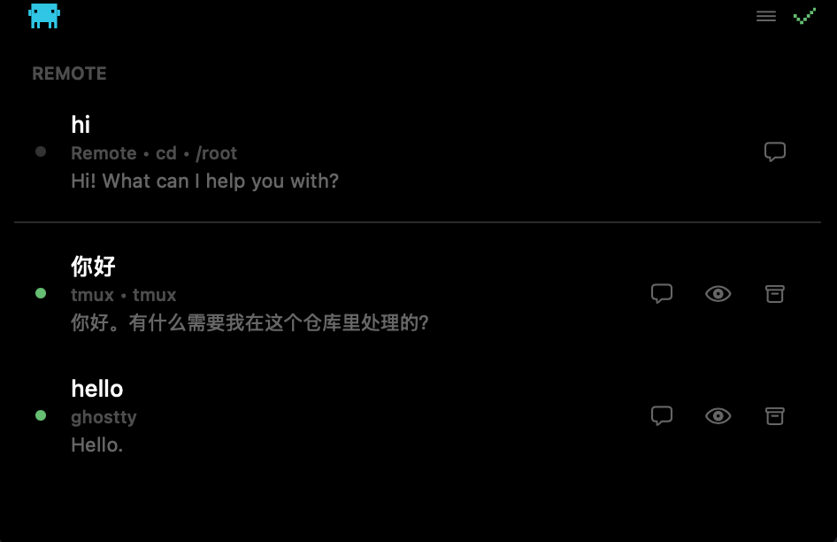
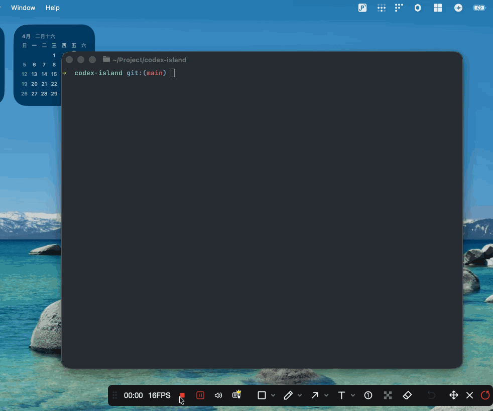

<div align="center">
  
  <h1 align="center">Codex Island</h1>
  <p align="center">
    面向 Codex CLI 的 Dynamic Island 风格 macOS 刘海区与菜单栏伴侣应用。
  </p>
  <p align="center">
    <a href="./README.md">English</a>
    ·
    <a href="https://github.com/Jarcis-cy/codex-island-app/releases/latest">最新版本</a>
  </p>
  <p align="center">
    <strong>把本地和远端 Codex 会话都放回刘海附近。</strong><br>
    不用反复切终端标签页，也能处理审批、切线程和找回上下文。
  </p>
  <p align="center">
    macOS 15.6+ · 本地 hooks · SSH 远端主机 · 审批流 · transcript 感知聊天
  </p>
  <p align="center">
    
  </p>
</div>

Codex Island 是一个面向 Codex CLI 的 macOS 刘海区与菜单栏伴侣应用。它能盯住本地会话，也能通过 SSH 连接远端机器，把聊天状态、审批请求和最近上下文收拢到一个更轻量的界面里，减少在终端窗口之间来回切换。

## 看看效果

<table>
  <tr>
    <td width="50%" align="center">
      
    </td>
    <td width="50%" align="center">
      
    </td>
  </tr>
  <tr>
    <td valign="top">
      <strong>远端工作流</strong><br>
      通过 SSH 连接远端机器、恢复 thread，并在同一个界面里处理远端 Codex 会话。
    </td>
    <td valign="top">
      <strong>本地工作流</strong><br>
      跟踪本地会话、展示 plan 风格交互，并在真正需要的时候再跳回正确的终端。
    </td>
  </tr>
</table>

## 功能亮点

- 通过 `~/.codex/hooks.json` 和本地 Unix Socket 监听 Codex 会话。
- 通过 SSH 连接远端机器，并通过 stdio 和 `codex app-server` 通信。
- 内置最近对话历史查看，并支持 Markdown 渲染，同时在聊天头部显示模型和上下文信息。
- 可直接在应用界面里处理审批流。
- 支持同时跟踪多个本地会话和远端 threads，并在它们之间快速切换。
- 可在应用内保存 SSH Target、可选默认工作目录和远端主机自动连接设置，也能直接使用 `~/.ssh/config` 里的 host alias。
- 提供开机启动、屏幕选择、提示音、应用内更新等能力。
- 在没有实体刘海的 Mac 上也能正常工作。

## 0.0.3 更新

- 把更多本地会话流程切到真实的本地 `codex app-server` 连接上，减少 transcript-only 回退带来的状态偏差。
- 新增本地 `/new` 和 `/resume`，可以直接在应用里新开本地线程或重新打开旧线程。
- 本地聊天补齐 `/plan`、`/model`、`/permissions` 的 app-server 驱动交互。
- 本地 plan 收尾后的后续选项现在更稳定地显示并可直接在 UI 回答，也兼容 `<proposed_plan>` 风格的完成输出。
- 补强缩起态 notch 的状态汇总、hover 命中、prompt 点击处理，以及调试启动稳定性。

## 运行要求

- macOS 15.6 或更高版本
- 本地已安装 Codex CLI
- 如果要管理远端主机，需要具备对应机器的 SSH 访问能力，且远端机器已安装 Codex CLI
- 如果需要窗口聚焦相关能力，需要授予辅助功能权限
- 如果要使用基于 tmux 的消息发送和审批流程，需要安装 `tmux`
- 如果要使用窗口聚焦集成，需要安装 `yabai`

## 安装

可以直接下载 GitHub Release，也可以本地构建。

调试构建：

```bash
xcodebuild -scheme CodexIsland -configuration Debug build
```

发布构建：

```bash
./scripts/build.sh
```

导出的应用位于 `build/export/Codex Island.app`。

## SSH 远端主机

可以从刘海菜单里的 `Remote Hosts` 入口添加 SSH Target、可选默认工作目录，以及每台远端主机是否自动连接。`SSH Target` 字段既支持直接输入 `user@host` / 裸主机名，也会在可用时提示本机 `~/.ssh/config` 里的 host alias。

连接远端主机时，Codex Island 实际执行的是：

```bash
ssh -T -o BatchMode=yes <target> codex app-server --listen stdio://
```

这意味着当前远端能力依赖非交互式 SSH 认证，且远端机器必须已经能在 `PATH` 上找到 `codex`。连接后，应用可以直接列出远端线程、新建线程、打开已有线程、发送消息、中断 turn，并在 UI 里处理审批。远端聊天视图支持 `/new` 显式新开 thread，也支持用 `/resume` 切回旧 thread。

远端 app-server 的诊断日志默认关闭。只有在菜单里启用 `Remote Debug Logs` 后，应用才会把 JSONL 诊断信息写入 `~/Library/Application Support/Codex Island/Logs/remote-app-server.jsonl`。

## 工作原理

首次启动时，Codex Island 会把受管的 hook 脚本安装到 `~/.codex/hooks/`，并更新 `~/.codex/hooks.json`。hook 脚本会把本地 Codex 的事件通过 Unix Domain Socket 转发给应用，应用再结合 transcript 信息做状态对账，以保持会话展示尽量准确。

远端主机走的是另一条链路：应用会通过 SSH stdio 连接到目标机器上的 `codex app-server`，并把远端 thread 状态与本地 hooks-first 会话一起呈现出来。

当前实现仍然是以 macOS 进程内的 hooks 流程为主。仓库里的 `sidecar/` 目录是预留给后续 Rust sidecar 的脚手架，计划承接 transcript 解析、状态聚合和本地 IPC 等职责。

## 项目结构

- `CodexIsland/App/`：应用生命周期和窗口启动
- `CodexIsland/Core/`：设置、几何计算、屏幕选择等基础能力
- `CodexIsland/Services/`：hooks、本机会话解析、远端 app-server 管理、tmux 集成、更新、窗口管理
- `CodexIsland/UI/`：刘海视图、菜单界面、聊天界面和复用组件
- `CodexIsland/Resources/`：随应用分发的脚本资源，例如 `codex-island-state.py`
- `scripts/`：构建、签名、公证、发布辅助脚本
- `sidecar/`：预留的 Rust sidecar 脚手架

## 隐私与遥测

当前应用集成了 Mixpanel 用于匿名产品分析，也集成了 Sparkle 用于应用更新。

代码里可见的分析事件主要围绕以下信息：

- 应用版本与构建号
- macOS 版本
- 检测到的 Codex 版本
- 会话启动事件

仓库当前没有声明会把对话内容发送到分析服务，但如果你计划在更敏感的环境里分发或使用，仍然应该先自行审查代码，再决定是否接受这部分取舍。

## 开发

日常开发直接用 Xcode 即可。仓库也带了完整的发布辅助脚本，可用于签名、公证、生成 DMG、生成 appcast，以及可选地发布 GitHub Release：

```bash
brew install swiftformat swiftlint
./scripts/swift-quality.sh
./scripts/install-git-hooks.sh
./scripts/create-release.sh
```

`./scripts/swift-quality.sh` 会在同一轮里同时检查 `CodexIsland/` 和 `CodexIslandTests/`。`./scripts/install-git-hooks.sh` 会把 Git 切到仓库内的 `.githooks/` 包装层，先保留 beads 现有 hooks，再在 `pre-commit` 里追加已暂存 Swift 文件的质量检查，避免历史质量债阻塞无关提交。

如果改动了 `CodexIsland/Services/Hooks/` 或 `CodexIsland/Resources/codex-island-state.py`，要把它视为会直接影响用户本地 Codex 环境的高风险改动，务必手工验证。

## 致谢

Codex Island 建立在原项目 [`farouqaldori/claude-island`](https://github.com/farouqaldori/claude-island) 的思路和早期实现之上。感谢 Farouq Aldori 以及上游贡献者打下基础，这个面向 Codex 的版本是在那套工作的延续上继续演进的。

## 许可证

Apache 2.0，详见 [`LICENSE.md`](./LICENSE.md)。
